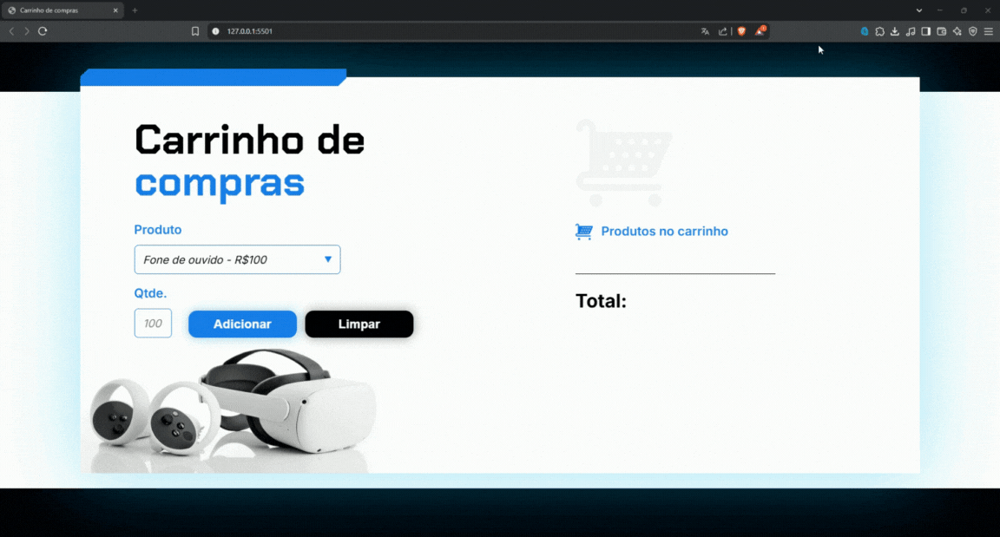

# 🛒 Carrinho de Compras Interativo

Este projeto é um site simples que simula um carrinho de compras dinâmico, desenvolvido com HTML, CSS e JavaScript puro.

## Funcionalidades

📋 Funcionalidades
- O usuário pode selecionar três produtos diferentes a partir de um menu suspenso.

- É possível definir a quantidade desejada para cada produto.

- Ao clicar em "Adicionar", o produto é incluído automaticamente em uma lista à direita, exibindo:
    - Quantidade

    - Nome do produto

    - Subtotal do item (quantidade × valor unitário)

- O sistema atualiza em tempo real o valor total da compra conforme novos produtos são adicionados.

- Um botão "Limpar" permite reiniciar o carrinho e o total.

## 🧠 Princípios de JavaScript Utilizados
Este projeto faz uso de vários conceitos fundamentais do JavaScript:

Manipulação do DOM (Document Object Model):
Através de métodos como getElementById, innerHTML e textContent, o site atualiza dinamicamente os elementos visuais com base nas ações do usuário.

Eventos e funções:
As funções adicionar() e limpar() são acionadas por eventos (como o clique em botões), encapsulando a lógica de adicionar e resetar o carrinho.

Strings e arrays:
O método split() é usado para extrair o nome e o valor do produto a partir da string selecionada no menu.

Conversão de tipos e cálculos:
A multiplicação de quantidade × valor unitário exige o tratamento de strings como números, garantindo que os cálculos retornem os valores corretos.

Interatividade e feedback visual:
Os dados são atualizados em tempo real, proporcionando uma experiência responsiva para o usuário.

## Demonstração

